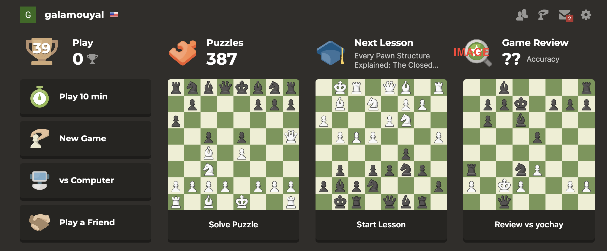

# Bootstrap

### Doc

- https://getbootstrap.com/docs/5.3/layout/containers/

- container
- row
- col
- breakpoints
- responsive grid

## Homework Bootstrap Design 15/1/2025

- Try to Design the following Page in Bootstrap. - 

- The image is presenting a large screen resolution lg
- When the Application Presented in sm/xs resolution support the Chess boards to spread the entire row.
- Try to use https://getbootstrap.com/docs/5.0/extend/icons/ for the image icons
- if you prefer to take the images from the real site: https://www.chess.com/
