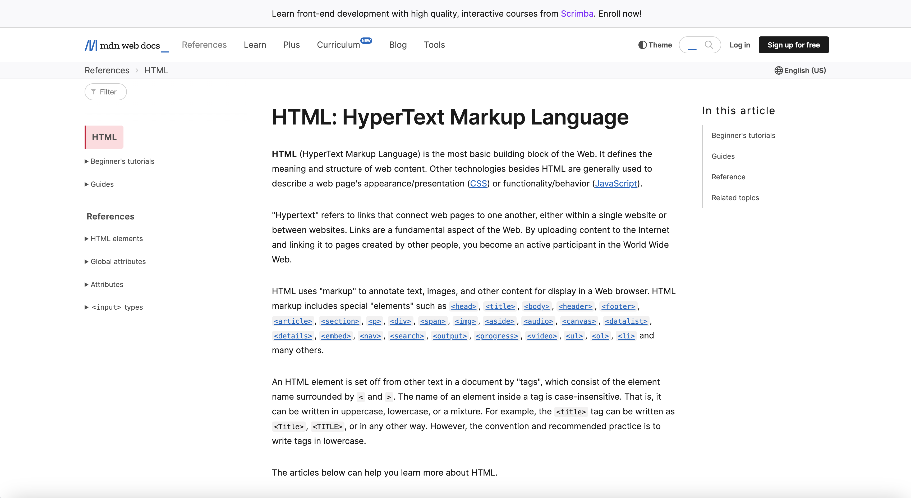

# Table

## Exercise Table:

1. Create website: bakery store
2. Create a Table with the following columns: Name, Type, Dairy ( Yes/No) Price, Image,
3. Insert 10 rows of data

# Homework 12-1-2025

1. Visit the following Page: https://developer.mozilla.org/en-US/docs/Web/HTML
2. Try to create the same page layout using flex and more CSS capabilities.
3. No need to create the entire page - but only the part presented in the following image: 
4. Learn about the following tags:

- search - https://developer.mozilla.org/en-US/docs/Web/HTML/Element/search
- audio - https://developer.mozilla.org/en-US/docs/Web/HTML/Element/audio
- video - https://developer.mozilla.org/en-US/docs/Web/HTML/Element/video
  Create a Table at the bottom of the page from:2,
  Columns: Tag Name, Link to doc, description.
  fill the table with the information about the tags you learned.

# Grid

### Overview

- The CSS grid layout module excels at dividing a page into major regions or defining the relationship in terms of size, position, and layer, between parts of a control built from HTML primitives.

- Like tables, grid layout enables an author to align elements into columns and rows. However, many more layouts are either possible or easier with CSS grid than they were with tables. For example, a grid container's child elements could position themselves so they actually overlap and layer, similar to CSS positioned elements.

#### Basic example

- `/grid/1/index.html`

1. positioning, locations each item will be located the default layout, or move to the next row.
2. grid-template-rows
3. grid-template-columns
4. repeat
5. ?
6. grid item

# Exercise Grid
## Try to design this page in Grid
-   

## More cool CSS examples:
### https://github.com/HoanghoDev/youtube_v2.git